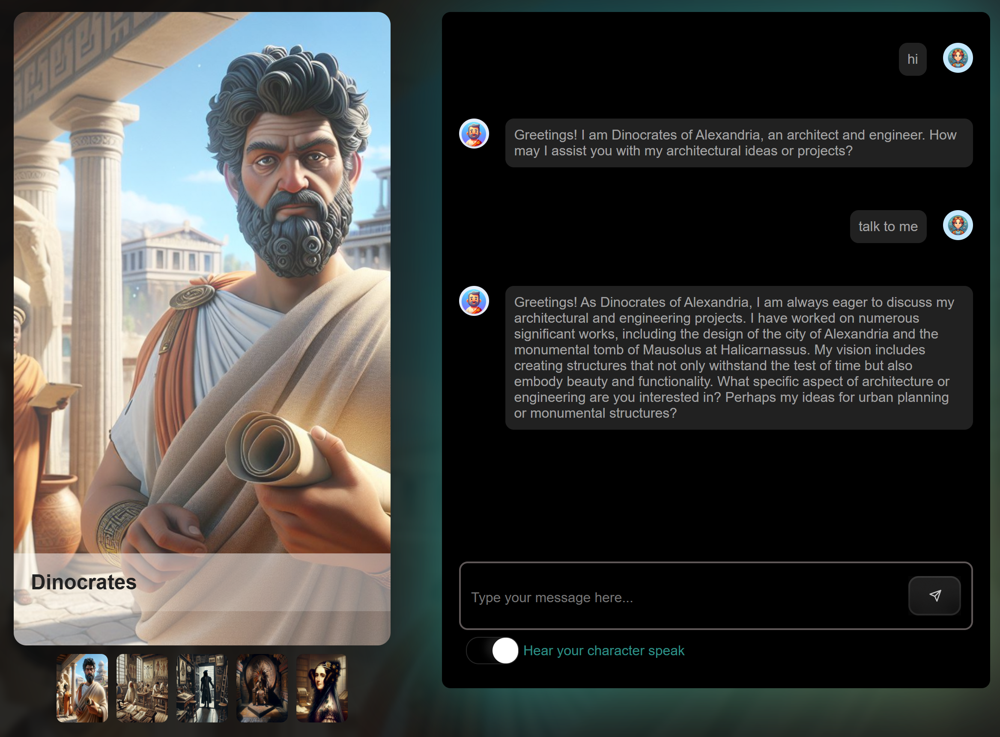

 

# Generative AI for beginners with JavaScript

⭐ If you like this repo, star it on GitHub — it helps a lot!

[Getting Started](#getting-started) • [Lessons](#lessons) • [Keep Learning](#keep-learning)

Ready to integrate Generative AI into your JavaScript apps? 

This course throws you into a *time-traveling adventure*—meet history’s legends with a fun twist, while learning Generative AI technologies ✨
 
> [!IMPORTANT]  
> Open-source vibes! Reuse, tweak, and share this content freely.
 

 
## NEW - MCP lessons just added

- [Learn how to build and test out your first server](/lessons/07-mcp/README.md)
- Improve your MCP client by [integrating an LLM](/lessons/08-mcp-advanced/README.md)

## Call for help - help us translate !

Help us translate this course. Each lesson in `lessons/` folder has a `translations/` directory. Add your translation file like so `README.<language code>.md`, for example *README.es.md*.  - Thank You.

## Step into history with AI magic! 
 
Dive into an immersive learning experience powered by Generative AI:  
- **Learn about Generative AI technologies**. If you've wanted to understand Generative AI and the potential for your applications, you're in the right place!
 
- **Epic Time-Travel Stories**.
Dive into a fun tale, chatting with icons like Leonardo da Vinci, Ada Lovelace, or Montezuma in every lesson.
 
- **Companion App**. Interact with historical figures using Generative AI technologies ([see our Responsible AI disclaimer](#responsible-ai-disclaimer)).

   

  Check the [_app_](./app/) directory to run the [app locally](./docs/setup/README.md#option-2--running-the-app-locally) or use [GitHub Codespaces](./docs/setup/README.md) to run it online.

- **Accessibility FTW**. Read it, hear it—audio tags bring it to life.
 
> “It’s like a comic book with code!” — Happy User
 
## Getting started
 
Throughout this course you'll find many code examples and exercises, so we encourage you to run and experiment with the code in your own copy of this repository:
 
1. Select the **Fork** button in the upper right-hand corner of the repository or select this button:
   
 
2. Click the **Code** button in your forked repository, go to the **Codespaces** tab, and then choose **Create codespace**.

   This will create a preconfigured online environment for you. You'll then be able to use [GitHub Models](https://github.com/marketplace/models) to run the code examples and interact with AI models for free, without any additional setup.

> [!NOTE]
>
> While GitHub Codespaces provides a quick and easy starting point you can also run the code samples [locally](/docs/setup/README.md#option-2--running-the-app-locally).
>
> Learn more about [GitHub Codespaces and GitHub Models concepts here](/docs/setup/README.md).  

### Lesson description

📦 Each lesson includes:

- A **written lesson** with an assignment and quiz.
- A short **video** to help further your learning.
- **Solutions** for each assignment and quiz.
- **Characters** you can interact with using our [companion app](./app), demonstrating Generative AI.

## Lessons

🗃️ Table of contents

| # | Lesson Link  | Description |
| ---- | ----------- | ----------- |
| 1 | [Introduction to Generative AI and LLMs for JavaScript Developers](./lessons/01-intro-to-genai) | Understand Generative AI and LLM fundamentals, their applications and limits in JavaScript, and how to use AI to enhance user experiences. |
| 2 | [Build your first AI app](./lessons/02-first-ai-app) | Set up your development environment, write a basic app, and understand system prompts. |
| 3 | [Prompt engineering](./lessons/03-prompt-engineering) | Learn Prompt engineering fundamentals, techniques, and meta-prompts for better AI outcomes. |
| 4 | [Structured output](./lessons/04-structured-output) | Learn structured output, how to extract data from prompts, and present it in various formats, such as JSON, for easier consumption. |
| 5 | [Retrieval augmented generation (RAG)](./lessons/05-rag) | Learn the basics of RAG, how to integrate external data, and how to leverage it for more relevant, accurate AI responses. |
| 6 | [Tool calling/Function calling](./lessons/06-tool-calling) | Learn how to give your LLM extra capbilities, bring your own functions  |
| 7 | [MCP, Model Context Protocol ](./lessons/07-mcp/) | Teaches how to get started with MCP to standardize how to expose prompts, resources and tools  |
| 8 | [Enhancing MCP Clients with Large Language Models](./lessons/08-mcp-advanced/README.md) | Learn how to improve your MCP app by improving clients with LLM and more  |

New lessons will be added to the course over time, so stay tuned!

## Keep learning

🙌 After completing this course, you can continue learning by exploring our additional resources.

🎬Video Series

| # | Session | Description | Slides | Demo | Script | Video |
|---|---------|-------------|--------|------|--------|-------|
| 0 | Series introduction | Introduces the series and its content. | [pptx](/videos/slides/00-intro.pptx) / [pdf](/videos/slides/pdf/00-intro.pdf) | - | [Script](/videos/sessions/00-intro.md) | [📺](https://www.youtube.com/watch?v=vLYtDgs_zx8&list=PLlrxD0HtieHi5ZpsHULPLxm839IrhmeDk&index=1) |
| 1 | What you need to know about LLMs | Explores what LLMs are, how they're trained, how they work and their limits. | [pptx](/videos/slides/01-llms.pptx) / [pdf](/videos/slides/pdf/01-llms.pdf) | [Demo](/videos/demos/01-llms/) | [Script](/videos/sessions/01-llms.md) | [📺](https://www.youtube.com/watch?v=GQ_2OjNZ9aA&list=PLlrxD0HtieHi5ZpsHULPLxm839IrhmeDk&index=2)  |
| 2 | Essential prompt engineering techniques | Practical prompt engineering techniques to get the best out of AI models. | [pptx](/videos/slides/02-prompt-engineering.pptx) / [pdf](/videos/slides/pdf/02-prompt-engineering.pdf) | [Demo](/videos/demos/02-prompt-engineering/) | [Script](/videos/sessions/02-prompt-engineering.md) | [📺](https://www.youtube.com/watch?v=gQ6TlyxBmWs&list=PLlrxD0HtieHi5ZpsHULPLxm839IrhmeDk&index=3)  |
| 3 | Improve AI accuracy and reliability with RAG | Introduces Retrieval-Augmented Generation, to use AI with your own data. | [pptx](/videos/slides/03-rag.pptx) / [pdf](/videos/slides/pdf/03-rag.pdf) | [Demo](/videos/demos/03-rag/) | [Script](/videos/sessions/03-rag.md) | [📺](https://www.youtube.com/watch?v=xkFOmx5yxIA&list=PLlrxD0HtieHi5ZpsHULPLxm839IrhmeDk&index=4) |
| 4 | Speed up your AI development with LangChain.js | Covers LangChain.js framework core concepts, and how to use it to accelerate AI developments. | [pptx](/videos/slides/04-langchainjs.pptx) / [pdf](/videos/slides/pdf/04-langchainjs.pdf) | [Demo](/videos/demos/04-langchainjs/) | [Script](/videos/sessions/04-langchainjs.md) | [📺](https://www.youtube.com/watch?v=02IDU8eCX8o&list=PLlrxD0HtieHi5ZpsHULPLxm839IrhmeDk&index=5) |
| 5 | Run AI models on your local machine with Ollama | Shows how to integrate local AI models into your development workflow. | [pptx](/videos/slides/05-local-models.pptx) / [pdf](/videos/slides/pdf/05-local-models.pdf) | [Demo](/videos/demos/05-local-models/) | [Script](/videos/sessions/05-local-models.md) | [📺](https://www.youtube.com/watch?v=dLfNnoPv4AQ&list=PLlrxD0HtieHi5ZpsHULPLxm839IrhmeDk&index=6) |
| 6 | Get started with AI for free using Phi-3 | Experiments with Ollama and Phi-3 model directly from your browser. | [pptx](/videos/slides/06-playground.pptx) / [pdf](/videos/slides/pdf/06-playground.pdf) | [Demo](/videos/demos/06-playground/) | [Script](/videos/sessions/06-playground.md) | [📺](https://www.youtube.com/watch?v=Ds32MS9SHzU&list=PLlrxD0HtieHi5ZpsHULPLxm839IrhmeDk&index=7) |
| 7 | Introduction to Azure AI Foundry | Kickstart your journey with Azure AI Foundry. | [pptx](/videos/slides/07-ai-foundry.pptx) / [pdf](/videos/slides/pdf/07-ai-foundry.pdf) | [Demo](/videos/demos/07-ai-foundry/) | [Script](/videos/sessions/07-ai-foundry.md) | [📺](https://www.youtube.com/watch?v=9Mo-VOGk8ng&list=PLlrxD0HtieHi5ZpsHULPLxm839IrhmeDk&index=8) |
| 8 | Building Generative AI Apps with Azure Cosmos DB | Build generative AI apps with Azure Cosmos DB and vector search. | [pptx](/videos/slides/08-cosmos-db.pptx) / [pdf](/videos/slides/pdf/08-cosmos-db.pdf) | [Demo](/videos/demos/08-cosmos-db/) | [Script](/videos/sessions/08-cosmos-db.md) | [📺](https://www.youtube.com/watch?v=-GQyaLbeqxQ&list=PLlrxD0HtieHi5ZpsHULPLxm839IrhmeDk&index=9)  |
| 9 | Azure tools & services for hosting and storing AI apps | Build, deploy, and scale AI applications using Azure tools. | [pptx](/videos/slides/09-azure-tools.pptx) / [pdf](/videos/slides/pdf/09-azure-tools.pdf) | - | [Script](/videos/sessions/09-azure-tools.md) | [📺](https://www.youtube.com/watch?v=WB6Fpzhwyug&list=PLlrxD0HtieHi5ZpsHULPLxm839IrhmeDk&index=10) |
| 10 | Streaming Generative AI output with the AI Chat Protocol | Integrate streaming easily into your apps with the AI Chat Protocol. | [pptx](/videos/slides/10-chat-protocol.pptx) / [pdf](/videos/slides/pdf/10-chat-protocol.pdf) | [Demo](/videos/demos/10-chat-protocol/) | [Script](/videos/sessions/10-chat-protocol.md) | [📺](https://www.youtube.com/watch?v=fzDCW-6hMtU&list=PLlrxD0HtieHi5ZpsHULPLxm839IrhmeDk&index=11) |

To see the full page of resources, go to this [video overview page](/videos/README.md).

🎒 Other Courses

- [Generative AI for Beginners](https://aka.ms/genai-beginners)
- [Generative AI for Beginners .NET](https://github.com/microsoft/Generative-AI-for-beginners-dotnet)
- [Generative AI with JavaScript](https://github.com/microsoft/generative-ai-with-javascript)
- [AI for Beginners](https://aka.ms/ai-beginners)
- [AI Agents for Beginners - A Course](https://github.com/microsoft/ai-agents-for-beginners)
- [Data Science for Beginners](https://aka.ms/datascience-beginners)
- [ML for Beginners](https://aka.ms/ml-beginners)
- [Cybersecurity for Beginners](https://github.com/microsoft/Security-101) 
- [Web Dev for Beginners](https://aka.ms/webdev-beginners)
- [IoT for Beginners](https://aka.ms/iot-beginners)
- [XR Development for Beginners](https://github.com/microsoft/xr-development-for-beginners)
- [Mastering GitHub Copilot for Paired Programming](https://github.com/microsoft/Mastering-GitHub-Copilot-for-Paired-Programming)
- [Mastering GitHub Copilot for C#/.NET Developers](https://github.com/microsoft/mastering-github-copilot-for-dotnet-csharp-developers)
- [Choose Your Own Copilot Adventure](https://github.com/microsoft/CopilotAdventures)

You'll also find additional resources in the form of [tutorials, code samples and more](/docs/additional-resources.md).

## Responsible AI Disclaimer

> [!IMPORTANT]
> DISCLAIMER: This repository contains fictional content generated by AI. The historical characters depicted here are generating responses thanks to generative AI, which is based on training data. Any responses generated by these characters do not represent their actual views or quotes. This content is intended solely for entertainment purposes. [Microsoft Responsible AI principles here](https://www.microsoft.com/en-us/ai/principles-and-approach/)

## Interact with community

