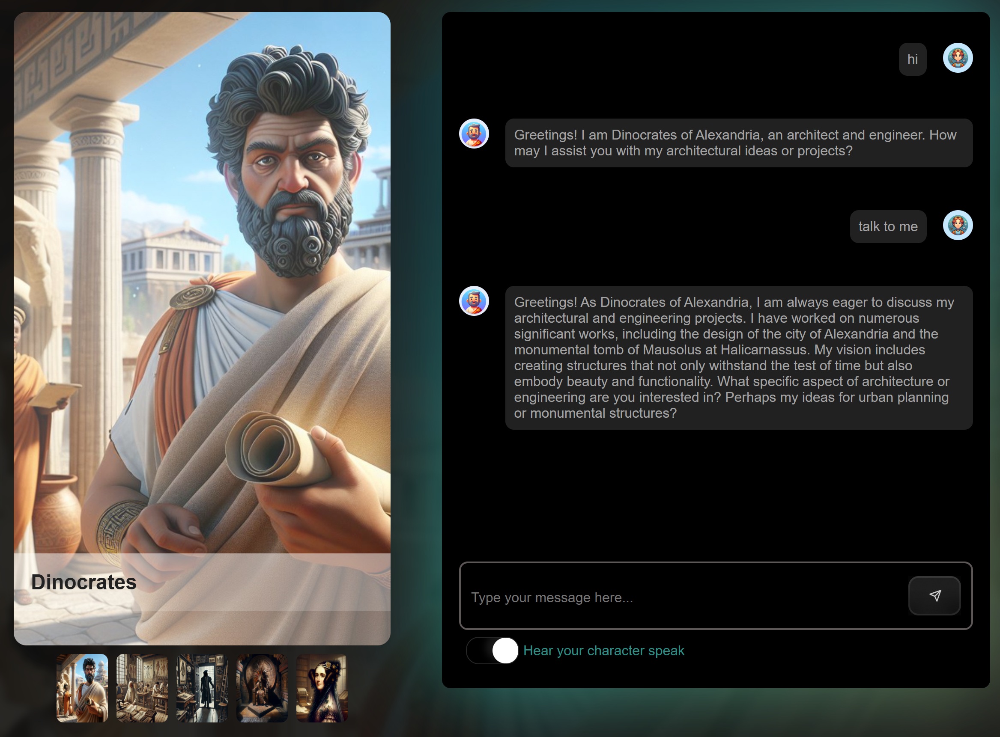

This app allows you to speak to all character features in the curriculum. 

There are two ways to interact with AI:

- A configured Azure OpenAI or OpenAI-compatible endpoint
- Copilot SDK [Copilot SDK](https://github.com/github/copilot-sdk/blob/main/docs/getting-started.md). This one uses your GitHub Copilot.

## Installation

Follow the [course setup guide](../docs/setup/README.md) to create a Microsoft Foundry project, deploy a chat model, obtain its endpoint and key, and configure the repository-root `.env`. The same steps apply to local development and Codespaces.

Use Node.js LTS for this app and the packages in the repository root. Lesson packages have their own requirements.

1. Start a [](https://codespaces.new/microsoft/generative-ai-with-javascript)
2. Navigate to _/app_ in the repo root.
3. Locate the console and run `npm ci`.
4. Run one of the commands below. Then select the "Open in Browser" button.

You should see something like:



## Run

Run the app by either:

**Azure OpenAI or an OpenAI-compatible endpoint**

Copy `.env.example` to `.env` in the repository root. Set these variables there or in your environment:

```dotenv
AI_ENDPOINT=https://YOUR-RESOURCE.openai.azure.com/openai/v1/
AI_API_KEY=your-api-key
AI_MODEL=your-model-deployment
```

For Azure OpenAI, `AI_MODEL` must be the deployment name. For OpenAI, use `https://api.openai.com/v1/` and a supported model name. The endpoint must use HTTPS; HTTP is allowed only for a loopback address used by a local provider.

```bash
npm start
```

To use another environment file without copying its keys, set `ENV_FILE`:

```bash
ENV_FILE="$HOME/.env" npm start
```

Existing environment variables take priority over values in the file. Missing settings or an unreadable explicit file stop the server with an error. Keep keys out of source control and browser code.

The [course setup guide](../docs/setup/README.md#configure-environment-variables) explains these variables and the repository-root `.env` location. No embedding model is required for this chat app.

**Copilot SDK**

```
npm run start:sdk
```

The SDK uses your GitHub Copilot subscription. Supply a Copilot-compatible token through `COPILOT_GITHUB_TOKEN`, `GH_TOKEN`, or `GITHUB_TOKEN`, or use GitHub CLI authentication. Do not put tokens in browser code.

## Safe use

Both servers listen on `127.0.0.1`. This sample does not authenticate HTTP callers. Keep Codespaces ports private. Do not expose the service to a public network. Remote deployment requires authentication, authorization, request limits, and an isolated service account.

SDK chat uses client mode `empty`, no available tools, a permission handler that rejects every request, and a pre-tool hook that denies every tool call. It does not load project configuration, custom agents, or MCP servers. Character instructions are appended to the SDK system message; they do not replace its guardrails. The SDK removes host environment context in `empty` mode.

The SDK uses a separate temporary directory for its state and working directory. Each request aborts, disconnects, and deletes its session. The temporary directory is removed on normal shutdown with `SIGINT` or `SIGTERM`. This directory is not an operating-system sandbox. Do not add tools or change the permission policy to support chat.

The SDK version is pinned in both manifests. After an SDK update, check these controls against the new API and runtime before exposing the service.

## Request format

Both backends accept the same `POST /send` request:

```json
{
  "message": "Tell me about your work.",
  "character": { "name": "ada" }
}
```

The server reads the character description from `public/characters.json`. It rejects empty or non-string messages, unknown character names, and character properties other than `name`. Invalid requests return HTTP 400 without calling an AI service.

## Tests

Run `npm test` in `app/`. The tests use local fake AI services. They do not use credentials or execute model-selected host commands.

The model client also has a 60-second request timeout. A missing or empty model answer returns HTTP 500 instead of a successful empty response.

## Interact with a character

You're faced with a text input field. Type your message and see the response from the character you are chatting with.

## Change the character

Select the character image to change the character you are speaking to.

## Change the character's behavior

In `public/characters.json`, the `description` property supplies the server-owned character instructions. Edit this file to change the character's personality. Do not send a description from the browser.

## Please read

> [!IMPORTANT]
> DISCLAIMER: This repository contains fictional content generated by AI. The historical characters depicted here are generating responses thanks to generative AI, which is based on training data. Any responses generated by these characters do not represent their actual views or quotes. This content is intended solely for entertainment purposes. [Microsoft Responsible AI principles here](https://www.microsoft.com/en-us/ai/principles-and-approach/)

## Optional Task: Adding audio

- **Adding background audio**, download the music (make sure it's royalty free). Place it in the `public/audio` folder and name it according to the `name` field in `characters.json`, for example "davinci.mp3". 
- Locate the `TODO` comment in `index.html` and uncomment the rows regarding playing background audio, should look something like this:

   ```javascript
   /*
    TODO: undo this comment once you've downloaded background music corresponding to your character
    see characters.json name field what to name a file, for example davinci.mp3
    */
    // backgroundAudio.src = `/audio/${character.name}.mp3`; // Updated to use character.name
    // backgroundAudio.volume = maxVolume;


    // backgroundAudio.play();
   ``` 

### Free resources for music

If you want to add free music to your own fork for the sake of experimentation on your own fork or clone. 

- Pixabay https://pixabay.com

  Here are some ideas you could try (remember many songs on this site have a creative commons license CC meaning it's only for personal projects unless it says CC0 in which case you can use it freely. ): 

  - Montezuma, https://pixabay.com/music/world-magical-ritual-shaman-amazonian-indians-197516/
  - Ada Lovelace, https://pixabay.com/music/classical-string-quartet-adagio-pour-cordes-289664/
  - Dinocrates, https://pixabay.com/music/mystery-ancient-181070/
  - Leonardo Da Vinci, https://pixabay.com/music/folk-medieval-background-196571/
  - Ludovico Sforza, https://pixabay.com/music/build-up-scenes-medieval-opener-270568/

- https://freemusicarchive.org/

and many more.
