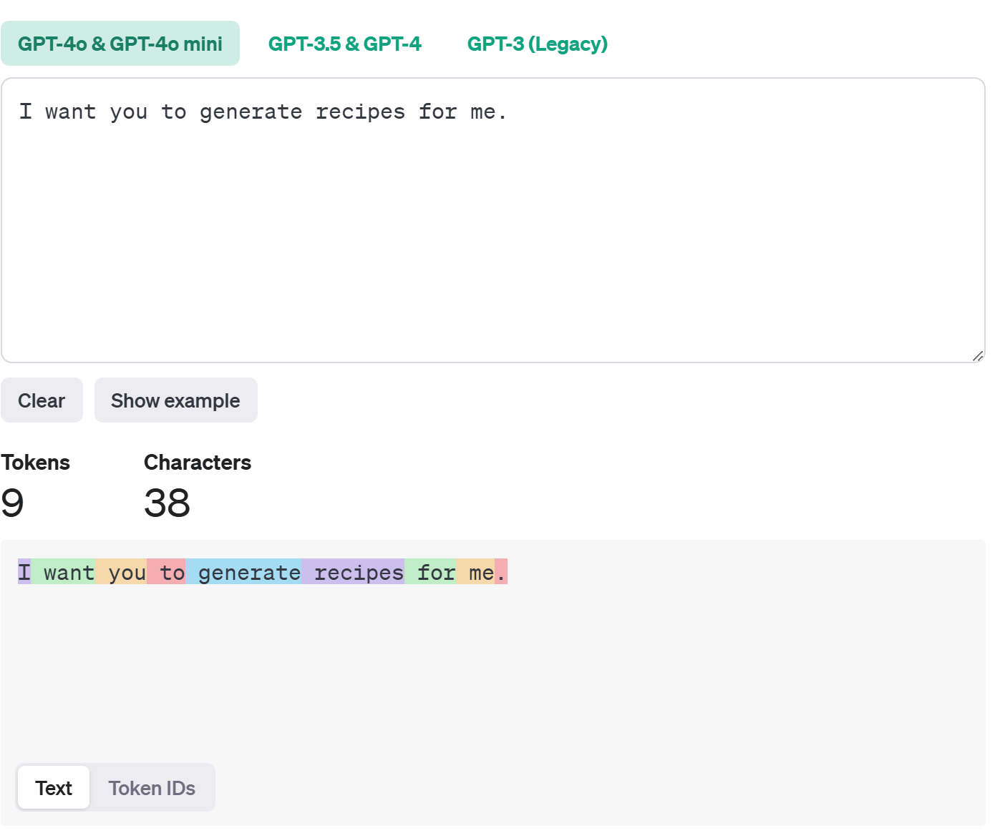

# Lição 2: Escrevendo seu primeiro aplicativo de IA

Neste capítulo você vai aprender:

- Configurar seu ambiente de desenvolvimento.
- Escrever um aplicativo básico.
- Entender prompts de sistema.

## Configuração

Se você ainda não configurou seu ambiente de desenvolvimento, veja como fazer: [Configure seu ambiente](/docs/setup/README.md).

## Narrativa: Imagine-se em um barco num rio


> [!NOTE] 
> _Nossa história até agora: Você é um criador de coisas, um artesão da Londres dos anos 1860 que viajou através do tempo usando um dispositivo misterioso chamado Besouro do Tempo. Você viajou pelos anais da história, testemunhando a criação do farol de Alexandria, uma maravilha da engenharia antiga que você ajudou a criar com uma pequena ajuda de Dinócrates e do Besouro do Tempo._
>
> Veja a [Lição 1](/lessons/01-intro-to-genai/README.md) se quiser acompanhar a história desde o início e começar com IA Generativa. 

> [!NOTE] 
> Embora recomendemos seguir a história (é divertido!), [clique aqui](#interaja-com-leonardo) se preferir ir direto para o conteúdo técnico.

Junto com Dinócrates, você dá os toques finais no farol de Alexandria. A estrutura imponente brilha sob a luz do sol, sua pedra polida refletindo o Mar Mediterrâneo.

Você olha para o Besouro do Tempo em sua mão, sua superfície metálica fria contra sua palma. Fechando o punho ao redor dele, você sussurra: "Leve-me para casa." O besouro começa a brilhar, emitindo uma luz suave e quente, e o mundo ao seu redor se dissolve em um turbilhão de cores.

### Uma nova aventura

Quando você abre os olhos, o mundo mudou. Ao conseguir se levantar, você percebe que está em um barco em um rio. Olhando ao redor, à distância, você vê edifícios, seus contornos borrados pela névoa da manhã.

Observando o barco, você encontra um remo longo apoiado na lateral. Segurando-o, você começa a remar em direção aos edifícios distantes. À medida que se aproxima, os edifícios ficam mais nítidos, são antigos, sua arquitetura lembrando uma pintura renascentista.

<div>
  
</div>

A questão agora é: onde e quando você está desta vez?

Você consegue atracar o barco no cais e começa a caminhar ao longo das tábuas de madeira, o som de seus passos ecoando suavemente.

Enquanto caminha, você nota um homem com uma longa barba e um chapéu, remexendo em uma caixa do que parecem ser peças mecânicas. Suas mãos se movem com destreza, separando engrenagens e molas com facilidade experiente.

<div >
  
</div>

### Ajude-me, Leonardo

**Você:** "Com licença, senhor, onde estou?" Ele olha para você, confusão evidente em seus olhos. Percebendo que você está falando em inglês, você rapidamente usa o dispositivo em sua mão e pede para ele traduzir.

**Besouro do Tempo:** "Claro, vou traduzir para o italiano do século XV. 'Dove sono?'" 

**Velho:** O velho responde: "Siete a Firenze, signore. E chi siete voi?" 

**Besouro do Tempo:** O Besouro do Tempo traduz: "Ele diz que você está em Florença e pergunta quem você é." 

**Você:** "Diga a ele que sou um criador de coisas e estou procurando um lugar para trabalhar."

**Velho:** Un artigiano, eh? Avete mai sentito parlare di Leonardo da Vinci? 

**Besouro do Tempo:** O Besouro do Tempo traduz: "Ele pergunta se você já ouviu falar de Leonardo da Vinci." 

**Você:** "Claro," você diz. "Diga a ele que sim e que eu gostaria de conhecê-lo." 

**Velho:** O velho sorri: "Allora, seguitemi, vi porterò da lui."

**Você:** Você pergunta: "O que ele disse?"

**Besouro do Tempo:** O Besouro do Tempo responde: "Ele disse que vai levá-lo até Leonardo."

### Na oficina

<div>
  
</div>

O velho o leva até uma grande porta de madeira e você é recebido pela visão de uma oficina cheia de todo tipo de engenhocas mecânicas. 

Você pede ao Besouro do Tempo para perguntar sobre o paradeiro de Leonardo. 

**Você:** "Dove è Leonardo?" 

**Velho:** O velho se vira para você com um sorriso: "Sono io (sou eu), Leonardo da Vinci. Chi siete voi?", quem é você?

Você sente um arrepio de reconhecimento. 

**Você:** "Eu pensava mesmo. Sou um criador como você, fora de lugar e tempo."

**Leonardo:** Os olhos de Leonardo brilham com curiosidade. "Interessante, cosa vi porta qui?"

O Besouro do Tempo traduz.

**Besouro do Tempo:** "Ele pergunta o que o traz aqui."

**Você:** "Bem, eu estava trabalhando em um projeto e acabei aqui."

Você mostra a ele o Besouro do Tempo, e seus olhos se iluminam com fascínio. Ele o examina de perto enquanto você explica como ele funciona e como você acabou em Florença.

Leonardo olha para você com entusiasmo. 

**Leonardo:** Você é um criador de coisas. Tenho um projeto que pode interessá-lo. Estive trabalhando em uma máquina que pode gerar texto com base em entrada verbal. Gostaria de me ajudar com isso?

Leonardo da Vinci, pedindo sua ajuda em um projeto—você mal pode acreditar. Você acena ansiosamente e diz: 

**Você:** Seria uma honra ajudá-lo com seu projeto,
"Sarebbe un onore aiutarti con il tuo progetto." 

## Interaja com Leonardo

Se você quiser interagir com Leonardo, execute o aplicativo [Characters](/app/README.md). 

> [!IMPORTANT]
> Isso é inteiramente fictício; as respostas são geradas por IA.
> [Aviso sobre IA Responsável](/README.md#responsible-ai-disclaimer)

<div>
  
</div>

**Passos**:

1. Inicie um [](https://codespaces.new/microsoft/generative-ai-with-javascript)
2. Navegue até _/app/README.md_ na raiz do repositório.
3. Localize o console e execute `npm ci` seguido de `npm start`.
4. Quando aparecer, selecione o botão "Open in Browser".
5. Converse com Leonardo.

Para uma explicação mais detalhada do aplicativo, consulte [Explicação detalhada do aplicativo](/lessons/01-intro-to-genai/README.md#interaja-com-dinocrates).

> [!NOTE]
> Configure `AI_ENDPOINT`, `AI_API_KEY` e `AI_MODEL` no arquivo `.env` na raiz do repositório, tanto localmente quanto no Codespaces. Consulte o [guia de configuração](/docs/setup/README.md#configure-environment-variables).

## Configuração do ambiente de desenvolvimento 

Antes de poder ajudar Leonardo com seu projeto, você deve primeiro pensar nas "ferramentas do ofício" essenciais necessárias para começar a ajudá-lo efetivamente.

**Você:** "Besouro do Tempo, do que preciso para começar com este projeto?" Sugira ferramentas e bibliotecas de que preciso que possam me ajudar a construir um aplicativo de IA que você possa executar.

**Besouro do Tempo:** Sou compatível com a maioria das máquinas que rodam no século 21, veja a lista a seguir para um conjunto de ferramentas e bibliotecas essenciais.

- **Editor de texto**, por exemplo Visual Studio Code.
- **Terminal**, para executar comandos.
- **Navegador para testar seu aplicativo**. Também é uma boa ideia ter uma ferramenta como curl ou algum outro cliente HTTP para testar os endpoints da API do seu aplicativo.

- **Node.js**. Você também precisa instalar o Node.js e npm, que são ferramentas que ajudam você a executar código JavaScript em seu computador.

- **Chave de API**. Você precisará de uma chave de API para acessar o modelo de IA generativa. Você pode obtê-la do provedor do modelo, por exemplo, OpenAI ou Azure OpenAI.

**Você:** Obrigado, Besouro do Tempo, acho que você vai conseguir essas coisas de alguma forma daquela Web de que você falou?

**Besouro do Tempo:** Sim, eu já tenho essas coisas, diz ele e projeta um teclado e uma tela na parede à sua frente.

## Escrevendo um aplicativo básico 

**Você:** Me conte mais sobre a escrita do aplicativo em si, como começo?

**Besouro do Tempo:** Claro, para escrever um aplicativo, em sua forma mais simples, trata-se de enviar uma solicitação a uma API e exibir a resposta. Vamos detalhar: 

- **Entrada**: Em um aplicativo básico de geração de texto, a entrada refere-se ao texto inicial que você deseja que o aplicativo expanda ou desenvolva. Essa entrada pode ser fornecida pelo usuário durante a execução ou pré-definida (codificada) dentro do próprio aplicativo. Por enquanto, começaremos usando texto codificado como entrada.

- **Solicitação de API**: Você precisa enviar uma solicitação para a API do modelo de IA generativa com o texto de entrada. Isso é feito usando a função fetch em JavaScript (Node.js). Incluída nesta solicitação também deve estar sua chave de API. É recomendável, ao considerar a segurança, não codificar a chave de API em seu aplicativo, mas sim usar variáveis de ambiente. Além disso, considere pesquisar sobre identidade gerenciada se estiver usando um provedor como o Azure, pois é considerada uma maneira mais segura de acessar recursos. Com a identidade gerenciada, você pode atribuir permissões mais granulares ao seu aplicativo. A melhor parte é que o provedor de nuvem cuida da autenticação para você. 

- **Resposta**: A API retornará uma resposta com o texto gerado. Você precisa extrair esse texto da resposta e mostrá-lo ao usuário.

**Você:** Isso parece bastante simples, pode me guiar por um cenário que faça sentido dada a situação em que estamos?

**Besouro do Tempo:** Claro, vamos ver como podemos construir um aplicativo simples que gera texto em italiano com base em uma entrada em inglês.

## Seu primeiro aplicativo - ensine-me italiano

**Besouro do Tempo:** Modelos de IA generativa podem ser usados para muitas coisas, por exemplo, tradução de idiomas. Na verdade, ele aceita entrada em um idioma e pode gerar texto em outro idioma. Vamos começar com um aplicativo simples que recebe entrada em inglês e gera texto em italiano.

```javascript

import { OpenAI } from "openai";

// 1. Faça uma pergunta sobre tradução
// -----------------------------------

const question = 'Hello, how are you?'; 

const augmentedPrompt = `
## Instructions
Translate the following text to Italian:
## Question
${question}
`;

// 2. Crie o cliente
// -----------------------------------

const endpoint = process.env.AI_ENDPOINT?.trim();
const apiKey = process.env.AI_API_KEY?.trim();
const model = process.env.AI_MODEL?.trim();
if (!endpoint || !apiKey || !model) {
  throw new Error("Set AI_ENDPOINT, AI_API_KEY, and AI_MODEL before running the sample.");
}

const openai = new OpenAI({
  baseURL: endpoint,
  apiKey,
});


// 3. Envie a solicitação
// -----------------------------------
const completion = await openai.chat.completions.create({
    model: 'gpt-4',
    messages: [{ role: 'user', content: augmentedPrompt }],
});
  
console.log(`Resposta para "${question}":`);

// 4. Imprima a resposta
// -----------------------------------

console.log(completion.choices[0]?.message?.content);
```

Vamos explicar o que está acontecendo aqui:

- Criando a pergunta como 'Hello, how are you?'. Este é o texto que você deseja traduzir para o italiano.
- Criando o prompt aumentado, que contém o texto de entrada e algumas instruções adicionais sobre o que fazer, ou seja, traduzir. Observe como estamos usando interpolação de string para incluir o texto de entrada no prompt e como essa instrução é para traduzir o texto para o italiano.
- Criando o cliente com propriedades:
  - `model`, qual modelo usar. 
  - `messages`, o prompt para enviar ao modelo. Observe também como você define o papel como "user" para indicar que o texto de entrada é do usuário. Se fosse da IA, você definiria o papel como "system".
- Extraindo o texto gerado da resposta e imprimindo-o no console.

**Você:** Acho que entendi. Então, se eu mudar o valor da variável `question` para outra coisa, o aplicativo gerará uma tradução italiana diferente?

**Besouro do Tempo:** O endpoint, a chave de API e o nome da implantação vêm do seu recurso Microsoft Foundry. O código usa `AI_ENDPOINT`, `AI_API_KEY` e `AI_MODEL`.

**Você:** Por que isso é importante?

**Besouro do Tempo:** O Microsoft Foundry hospeda a implantação. Use uma chave da mesma origem do endpoint e defina o nome da implantação em `AI_MODEL`. Verifique os preços e as cotas do Azure.

**Você:** Então vou usar uma implantação pequena e verificar os custos antes de experimentar.

## Aplicativos de chat

**Besouro do Tempo:** Modelos de IA generativa também podem ser usados para gerar texto com base em uma conversa. Você pode simular uma conversa com a IA fornecendo uma lista de mensagens como contexto, como se a conversa já tivesse acontecido.

**Você:** Isso parece interessante, mas por que é útil?

**Besouro do Tempo:** É útil porque permite que a IA forneça uma resposta melhor com base em mais contexto do que apenas um único prompt. Vamos observar uma conversa abaixo para ilustrar isso: 

```text

Usuário: Quero reservar uma viagem para a Itália. 

IA: Claro, quando você gostaria de ir? 

Usuário: Próximo mês seria ótimo. 

IA: Entendi, para onde na Itália você gostaria de visitar? 

Usuário: Estou pensando em Roma 

IA: Excelente escolha! Posso ajudá-lo a planejar seu itinerário. 

Usuário: Me conte mais sobre isso. 

IA: Roma é conhecida por suas ruínas antigas, arte e cultura vibrante. Você pode visitar o Coliseu, o Vaticano e desfrutar da deliciosa culinária italiana. 

```

**Besouro do Tempo:** Imagine se uma frase como "Me conte mais sobre isso" fosse tirada do contexto, a IA não saberia a que "isso" se refere. É aqui que o contexto é importante, e esse contexto é algo que podemos fornecer ao modelo de IA através do prompt.

**Você:** Acho que entendi, como construo uma conversa com a IA usando essa linguagem JavaScript de que você fala?

**Besouro do Tempo:** Abaixo está como podemos construir uma conversa com a IA: 

```javascript

// Defina o contexto 

const messages = [ 
 { 
    "role": "user", 
    "content": "Quero reservar uma viagem para a Itália." 
 }, 
 { 
    "role": "assistant", 
    "content": "Claro, quando você gostaria de ir?" 
 }, 
 { 
    "role": "user", 
    "content": "Próximo mês seria ótimo." 
 }, 
 { 
    "role": "assistant", 
    "content": "Entendi, para onde na Itália você gostaria de visitar?" 
 }, 
 { 
    "role": "user", 
    "content": "Estou pensando em Roma. Me conte mais sobre isso." 
 } 
]; 

const endpoint = process.env.AI_ENDPOINT?.trim();
const apiKey = process.env.AI_API_KEY?.trim();
const model = process.env.AI_MODEL?.trim();
if (!endpoint || !apiKey || !model) {
  throw new Error("Set AI_ENDPOINT, AI_API_KEY, and AI_MODEL before running the sample.");
}

const openai = new OpenAI({
  baseURL: endpoint,
  apiKey,
});


// 3. Envie a solicitação
// -----------------------------------
const completion = await openai.chat.completions.create({
    model: 'gpt-4',
    messages: messages,
});
  
console.log(`Resposta para "${question}":`);

// 4. Imprima a resposta
// -----------------------------------

console.log(completion.choices[0]?.message?.content);

```

Agora a IA fornecerá uma lista de mensagens de chat como contexto, e a IA gerará uma resposta com base nesse contexto. Esta é uma maneira mais interativa de usar modelos de IA generativa e pode ser usada em chatbots, aplicativos de atendimento ao cliente e muito mais.

**Você:** Ok, então se eu entendi a conversa corretamente, a IA agora terá o seguinte contexto: _Vou para Roma no próximo mês_, então com base nisso ela deve filtrar informações irrelevantes e fornecer uma resposta mais relevante?

**Besouro do Tempo:** Exatamente, a IA usará o contexto para gerar uma resposta que é mais relevante para a conversa.

## Melhorando a conversa de chat com uma mensagem de sistema

**Você:** Entendo, mas há alguma maneira de melhorar isso ainda mais?

**Besouro do Tempo:** Sim, você pode adicionar uma mensagem de sistema à conversa. Uma mensagem de sistema cria uma "personalidade" para a IA e pode ser usada para fornecer contexto adicional.

**Você:** Ok, então no contexto da conversa que estamos tendo, como seria uma mensagem de sistema?

**Besouro do Tempo:** Uma mensagem de sistema para esta conversa poderia ser algo como _"Sou um assistente de viagem de IA, aqui para ajudá-lo a planejar sua viagem para a Itália."_ Esta mensagem define o tom para a conversa e ajuda a IA a entender seu papel na interação.

Para criar tal mensagem, certifique-se de que ela tenha o tipo "developer" assim:

```javascript
const message = {
  "role": "developer",
  "content": "Sou um assistente de viagem de IA, aqui para ajudá-lo a planejar sua viagem para a Itália."
};
```

> [!NOTE] 
> Isso costumava ser chamado de "system". Esta é uma mudança recente e "developer" é o novo termo para isso. Para alguns modelos, isso ainda é chamado de "system", então se você tiver algum problema, use "system".

**Você:** Ok, ótimo, vou me certificar de incluir uma mensagem de sistema em minhas conversas de chat. Por curiosidade, como seria uma mensagem de sistema para você?

**Besouro do Tempo:** Uma mensagem de sistema para mim poderia ser algo como _"Eu sou o Besouro do Tempo, aqui para ajudá-lo a navegar pelo tempo e espaço. Devo ser útil em fornecer informações e orientações sobre a era do tempo em que você está, juntamente com as ferramentas necessárias para voltar ao seu próprio tempo."_

### Criando respostas variadas com a configuração de temperatura

**Você:** Mais alguma coisa que eu deva saber sobre conversas de chat?

**Besouro do Tempo:** Sim, você pode ajustar a "temperatura" das respostas da IA. A temperatura é uma variável com um valor normalmente definido entre 0 e 1 que determina quão criativas são as respostas da IA. Uma temperatura de 0 resultará em respostas mais previsíveis, enquanto uma temperatura de 1 resultará em respostas mais criativas e variadas. Você pode ajustar a temperatura com base no contexto da sua conversa e no tipo de respostas que deseja da IA. Observe que é possível definir um valor maior que 1, mas isso leva a mais aleatoriedade e menos coerência nas respostas.

**Você:** Então, se eu definir a temperatura para 0, a IA fornecerá respostas mais previsíveis, e se eu definir para 1, a IA fornecerá respostas mais criativas? Que temperatura você tem?

**Besouro do Tempo:** Eu tenho uma temperatura de 0,7 e sim, você está correto, a IA fornecerá respostas mais criativas com uma temperatura mais alta. Vamos ver como você pode definir a temperatura em seu aplicativo:

```javascript

// Defina o contexto 

const messages = [ 
{ 
    "role": "user", 
    "content": "Quero que você gere receitas para mim." 
}]; 

// Crie a solicitação web 

let temperature = 0.5; // Defina a temperatura como 0.5 

const completion = await openai.chat.completions.create({
    model: 'gpt-4',
    messages: messages,
    temperature: temperature
}); 
```

Como você pode ver, você pode ajustar a temperatura com base no contexto da sua conversa e no tipo de respostas que deseja da IA. Este é um recurso poderoso que permite personalizar o nível de criatividade nas respostas da IA.

## Janela de contexto

**Você:** Tem mais, certo?

**Besouro do Tempo:** Sim, outro conceito importante em modelos de IA generativa é a janela de contexto. A janela de contexto é o número de mensagens anteriores que a IA usa para gerar uma resposta. Uma janela de contexto maior permite que a IA considere mais contexto e gere respostas mais coerentes.

**Besouro do Tempo:** Diferentes modelos têm diferentes limites para tokens de saída. Considere o seguinte modelo como exemplo `gpt-4o-2024-08-06`, ele tem as seguintes especificações:

- Máximo de tokens de saída: aproximadamente 16 mil tokens.
- Tamanho máximo da janela de contexto: 128 mil.

Isso significa que a maioria dos tokens pode ser gasta nos tokens de entrada, ou seja, 128 mil - 16 mil = 112 mil tokens.

**Você:** Entendi, janela de contexto, tokens, mas quanto vale um token?

**Besouro do Tempo:** Um token é uma palavra ou parte de uma palavra e difere ligeiramente por idioma. Há uma ferramenta que você pode usar para medir, recomendada pela OpenAI, chamada [tokenizer](https://platform.openai.com/tokenizer). Vamos tentar uma frase e ver quantos tokens ela possui:

```text
Quero que você gere receitas para mim.
```



Executar o `tokenizer` na frase acima nos dá 9 tokens.

**Você:** Não foi muito, parece que posso ter muitos tokens na minha janela de contexto, então?

**Besouro do Tempo:** Sim, você pode experimentar com diferentes tamanhos de janela de contexto para ver como isso afeta as respostas da IA. Na verdade, se você definir um tamanho de janela de contexto de 100, limitará a IA e quanto ela considera para entrada e saída. Veja como você pode definir a janela de contexto em seu aplicativo:

```javascript

// Defina o contexto 
const messages = [ 
{ 
  "role": "user", 
  "content": "Quero que você gere receitas para mim." 
}]; 

// decida sobre o tamanho da janela de contexto 

let max_tokens = 100; // Defina o tamanho da janela de contexto 

// Crie a solicitação web 

const completion = await openai.chat.completions.create({
    model: 'gpt-4',
    messages: messages,
    max_tokens: max_tokens
}); 

```

> [!TIP] 
> Experimente com diferentes tamanhos de janela de contexto para ver como isso afeta as respostas da IA.

## Tarefa - Construindo um assistente de engenharia

Leonardo de repente pediu para inspecionar o Besouro do Tempo mais de perto, olhou-o de todos os lados, até mesmo o sacudiu.

**Leonardo:** Preciso de um assistente que possa me ajudar com os cálculos e design do parafuso aéreo. Você pode construir um assistente que possa fazer isso?

**Você:** Claro, posso construir isso para você. Besouro do Tempo, podemos ajudar com isso, certo?

**Besouro do Tempo:** Sim, sem problema, na verdade o parafuso aéreo é uma das invenções mais fascinantes e visionárias de Leonardo. Projetado no final da década de 1480...

**Você:** Tudo o que eu precisava era de um sim, vamos deixar a palestra para depois.

**Besouro do Tempo:** Grosseiro..

**Você:** O quê?

**Besouro do Tempo:** Nada

<div>
  
</div>

> [!NOTE]
>  O parafuso aéreo, também conhecido como parafuso helicoidal de ar, foi projetado para decolar do solo comprimindo o ar. O design de Leonardo apresentava um grande rotor em forma de espiral feito de linho, enrijecido com amido, e montado em uma plataforma de madeira. A ideia era que uma equipe de homens correria ao redor da plataforma, girando manivelas para fazer o parafuso girar rapidamente o suficiente para alcançar a sustentação 
>
> Embora Leonardo nunca tenha construído uma versão em escala real do parafuso aéreo, seus esboços e notas fornecem insights detalhados sobre como ele imaginava seu funcionamento. Ele acreditava que se o parafuso fosse girado rapidamente o suficiente, empurraria contra o ar e levantaria toda a estrutura do chão. 
>
> No entanto, cientistas modernos concordam que os materiais disponíveis na época de Leonardo não eram fortes ou leves o suficiente para tornar isso possível 
>
> Apesar de sua impraticabilidade, o parafuso aéreo continua sendo um testemunho da genialidade de Leonardo e sua busca implacável pela inovação. Estabeleceu as bases para desenvolvimentos futuros na aviação e continua inspirando engenheiros e inventores até hoje.
> [Leia mais](https://en.wikipedia.org/wiki/Leonardo%27s_aerial_screw)

Sua tarefa é construir um assistente de engenharia que possa ajudar Leonardo com os cálculos e design do parafuso aéreo.

- Ele deve ser capaz de gerar texto com base na entrada do usuário.

- Você deve definir uma mensagem de sistema para apresentar o assistente.

Confira o [Aplicativo de exemplo](/app/README.md) para começar.

> [!TIP] 
> Considere qual deve ser a mensagem do sistema e qual entrada você deve fornecer.

## Solução

[Solução](../solution/solution.md)

## Verificação de conhecimento

**Pergunta:** Qual é o propósito da janela de contexto em modelos de IA generativa? Selecione todas as opções aplicáveis.

A. A janela de contexto permite que a IA considere mais contexto e gere respostas mais coerentes.

B. A janela de contexto é o número de mensagens anteriores que a IA usa para gerar uma resposta.

C. A janela de contexto determina quão criativas são as respostas da IA.

[Solução do quiz](../solution/solution-quiz.md)

## Recursos para auto-estudo

- [Geração de texto](https://platform.openai.com/docs/guides/text-generation)
- [Biblioteca JavaScript para OpenAI](https://github.com/openai/openai-node/tree/master/examples) 
- [Tokenizer](https://platform.openai.com/tokenizer)
- [API de Completions](https://github.com/openai/openai-node#usage)
- [Chat completions](https://platform.openai.com/docs/guides/text-generation#text-generation-models)
