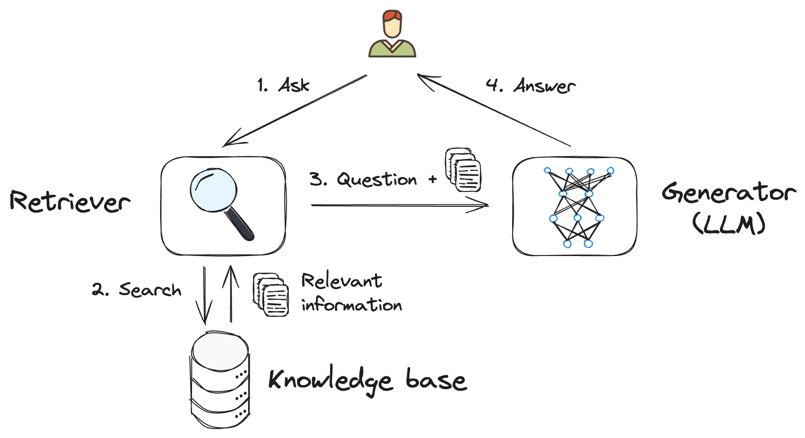
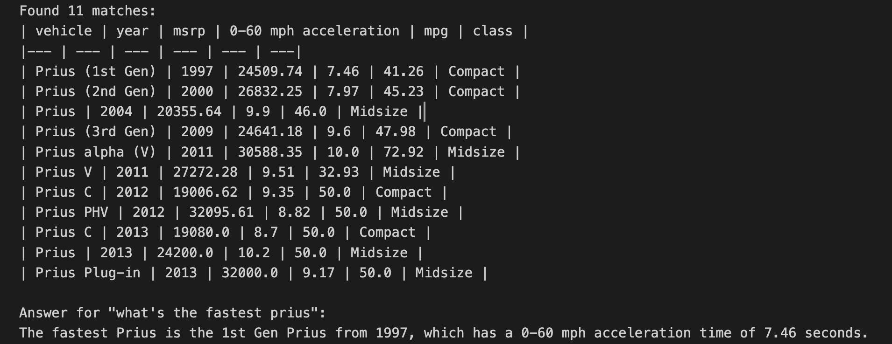

# Lesson 5: Talk to your data with Retrieval-Augmented Generation (RAG)

In this lesson, you will learn:
- The basics of Retrieval-Augmented Generation (RAG) and how it can be used to enhance the responses of generative AI models.
- How to integrate external data sources into your AI application.
- To leverage your data to improve the relevance and accuracy of the AI-generated content.

## Related resources

[](https://www.youtube.com/watch?v=xkFOmx5yxIA&list=PLlrxD0HtieHi5ZpsHULPLxm839IrhmeDk&index=4)

*🎥 Click on the image above to watch a short video about RAG*

- **Slides:** [pptx](../../videos/slides/03-rag.pptx) / [pdf](../../videos/slides/pdf/03-rag.pdf)

## Narrative: The birth of the World Wide Web

Your journey through time and technology has brought you to the [CERN](https://en.wikipedia.org/wiki/CERN) around 1992, where you are about to meet Tim Berners-Lee, the inventor of the World Wide Web. As you walk through the corridors of the research facility, you can't help but feel a sense of excitement and anticipation. You finally arrive at a small office, where Tim is waiting to greet you.

You can't wait to hear more about the World Wide Web and the incredible impact it will have on the world. As you prepare to ask your questions, you want to make sure the answers are as accurate and informative as possible. You've heard about a new technique called Retrieval-Augmented Generation (RAG) that can help enhance the responses of AI models by integrating external data sources. This seems like the perfect opportunity to put it to the test.


## Known Challenges with LLMs

Before we talk about the specifics of RAG, let's take a moment to discuss some of the known challenges with LLMs. These models are trained on huge amounts of text data and can generate responses that are contextually relevant and grammatically correct. However, just like any data that you can find on the internet, the information generated by LLMs can sometimes be inaccurate, incomplete, or misleading, because of multiple factors:
- **Out of date sources:** The data used to train the model may be outdated and no longer accurate.
- **Wrong or inaccurate information:** The sources used to train the model may contain incorrect or misleading information, like fake news or biased opinions.
- **Non-authoritative sources:** The model may not be able to distinguish between authoritative and non-authoritative sources in its training data, leading to unreliable information.

This makes it difficult to tell if an information generated by an LLM is correct or not. This is where RAG comes in.

## RAG Core Concepts

**Retrieval-Augmented generation** (RAG) is a powerful technique that combines the strengths of two different approaches in natural language processing: retrieval-based methods and generative models. This hybrid approach allows for the generation of responses that are both contextually relevant and rich in content, to help alleviate some of the known challenges with LLMs.

At its core, RAG involves two main components: a **retriever** and a **generator**.

- *The retriever:* it's responsible for finding relevant information from external data sources that can be used to enhance the AI-generated responses, like a search engine. This information can be in the form of text, images, or any other type of data that is relevant to the context of the conversation, although text is the most common type of data used.

- *The generator:* it takes the retrieved information and use it to generate a response that is contextually relevant and informative.

Here's a schema illustrating how a RAG system works:



1. **User input:** The user asks a question.
2. **Retriever:** The retriever component searches for relevant information using one or more knowledge bases.
3. **Augmented prompt:** The retrieved information is combined with the user question and context, to create an augmented prompt.
4. **Generator:** The LLM uses the augmented prompt to generate a response.

This combination allows for more precise and relevant answers, by using data that you provide instead of relying on the model’s training data.

## Integrating external data sources

Integrating external data sources into your AI application can be done in a variety of ways, depending on the type of data you want to use and the complexity of the retrieval mechanism. Here are a few common methods:

- **APIs:** Many external data sources provide APIs that allow you to access their data programmatically. You can use these APIs to retrieve information in real-time and use it to enhance the AI-generated responses.

- **Databases:** If you have a large amount of data that you want to use for retrieval, you can store it in a database and query it as needed. This can be useful for structured data that needs to be accessed quickly.

Once you've settled on a method for integrating external data sources, you may also need to consider how to preprocess and format the data so that it can be easily used by the AI model. This can involve cleaning the data, converting it to a suitable format (such as plain text or Markdown), or splitting it into smaller chunks for easier retrieval.

> [!NOTE]
> When integrating external data sources into your AI application, it's important to consider the privacy and security implications of accessing and storing data. Make sure you have the necessary permissions and safeguards in place to protect the data and comply with any relevant regulations.

If you're using a database, you also want to think how you want to *search your data* to retrieve the most relevant information. This can be done using keyword search, full-text search, or more advanced techniques like semantic search or vector search that may need specific indexing. We'll cover advanced search techniques in a future lesson.

## Augmenting the prompt

After you've implemented a way to retrieve information from your data sources, you can use this information to *augment the prompt* that you provide to the AI model. This can be done by adding the retrieved information to the input text that you pass to the model, along with additional context or instructions to help guide the generation process.

For example, if you're building an app to answer questions about cars, you could have a prompt like this:

```
## Instructions
Answer questions about cars using only the sources below.
If there's not enough data in provided sources, say that you don't know.
Be brief and straight to the point.

## Sources
<insert the retrieved information here>

## Question
<insert the question here>
```

By providing the AI model with additional context and information, you can help guide the generation process and ensure that the responses are accurate and relevant to the topic at hand.

> [!TIP]
> Note this part of the prompt: `If there's not enough data in provided sources, say that you don't know.`. This is important to avoid the AI generating incorrect information when there's not enough data to provide a reliable answer. This technique is called an *escape hatch* and is a good practice to ensure the quality of the generated content.

With this part it's becoming more obvious how RAG can also be considered as an advanced form of *prompt engineering*.

### Code Example

Let's now put this knowledge into practice by integrating a simple retrieval mechanism into a JavaScript application. We'll use a [CSV](https://fr.wikipedia.org/wiki/Comma-separated_values) file containing data about hybrid cars, and a simple search algorithm to find relevant information based on a user question.

```javascript
// This example demonstrates how to use the Retrieval Augmented Generation (RAG)
// to answer questions based on a hybrid car data set.
// The code below reads the CSV file, searches for matches to the user question,
// and then generates a response based on the information found.

import { fileURLToPath } from 'node:url';
import { dirname } from 'node:path';
import process from "node:process";
import fs from "node:fs";
import { OpenAI } from "openai";

// Change the current working directory to the directory of the script
const __dirname = dirname(fileURLToPath(import.meta.url));
process.chdir(__dirname);

// 1. Ask a question about hybrid cars
// -----------------------------------

const question = `what's the fastest prius`;

// 2. Retriever component: search the data for relevant information
// ----------------------------------------------------------------

// Load CSV data as an array of objects
const rows = fs.readFileSync("./hybrid.csv", "utf8").split("\n");
const columns = rows[0].split(",");

// Search the data using a very naive search
const words = question
  .toLowerCase()
  .replaceAll(/[.?!()'":,]/g, "")
  .split(" ")
  .filter((word) => word.length > 2);
const matches = rows.slice(1).filter((row) => words.some((word) => row.toLowerCase().includes(word)));

// Format as a markdown table, since language models understand markdown
const table =
  `| ${columns.join(" | ")} |\n` +
  `|${columns.map(() => "---").join(" | ")}|\n` +
  matches.map((row) => `| ${row.replaceAll(",", " | ")} |\n`).join("");

console.log(`Found ${matches.length} matches:`);
console.log(table);

// 3. Context augmentation: create a combined prompt with the search results
// --------------------------------------------------------------------------

const augmentedPrompt = `
## Instructions
Answer questions about hybrid cars using only the sources below.
If there's not enough data in provided sources, say that you don't know.
Be brief and straight to the point.

## Sources
${table}

## Question
${question}
`;

// 4. Generator component: use the search results to generate a response
// ---------------------------------------------------------------------

const openai = new OpenAI({
  baseURL: "https://models.inference.ai.azure.com",
  apiKey: process.env.GITHUB_TOKEN,
});

const chunks = await openai.chat.completions.create({
  model: "gpt-4o-mini",
  messages: [{ role: "user", content: augmentedPrompt }],
  stream: true,
});

console.log(`Answer for "${question}":`);

for await (const chunk of chunks) {
  process.stdout.write(chunk.choices[0].delta.content ?? "");
}
```

> [!IMPORTANT]
> Follow [the dev setup guide](../../docs/dev-setup.md) to see how to setup your environment to run this code.

You can find this code in the `example/rag-cars.js` file along with the `hybrid.csv` file containing the data used for the retrieval.

Once you run this code, you should see the data found by in the CSV file by the retriever, formatted as a markdown table, followed by the AI-generated response to the question. Try changing the question to see how the retrieved data and response changes. You can also try asking questions about unrelated topics to see how the AI model handles them.



## Assignment - Hallway chat with Tim Berners-Lee

It's time for your conversation with the father of the web! Let's create a chatbot that acts as a virtual Tim Berners-Lee in 1992, answering your questions about the Web in making. But in order to avoid creating a break in the space-time continuum, we'll need to make sure that the answers are as accurate and informative as possible, so we'll use Wikipedia data to provide grounding to the AI-generated responses.

You can start from the code example provided above, and modify it to include a retrieval mechanism that fetches Tim Berners-Lee's information from Wikipedia.

Here's an example code that retrieves text information about Tim Berners-Lee from Wikipedia:

```javascript
const response = await fetch('https://en.wikipedia.org/w/api.php?format=json&action=query&prop=extracts&redirects=true&explaintext&titles=Tim%20Berners-Lee');
const data = await response.json();
const text = Object.values(data.query.pages)[0]?.extract;
```

## Knowledge Check

**Question**: What is the role of the retriever in a RAG system?

- [ ] A. The retriever generates responses based on the input data.
- [ ] B. The retriever generates relevant information based on the model's training data.
- [ ] C. The retriever finds relevant information from external data sources.

<!-- Answer: C  -->

## Self-Study Resources

- **Learn docs:** [Retrieval-Augmented Generation and Indexes](https://learn.microsoft.com/azure/ai-studio/concepts/retrieval-augmented-generation)
- **Sample apps**:
  * [Serverless AI Chat with RAG](https://github.com/Azure-Samples/serverless-chat-langchainjs/)
  * [Ask Youtube: A RAG-based Youtube Q&A API](https://github.com/Azure-Samples/langchainjs-quickstart-demo)
- **Full length workshop:** [Create your own ChatGPT with RAG](https://moaw.dev/workshop/gh:azure-samples/azure-openai-rag-workshop/docs/workshop-qdrant.md)
