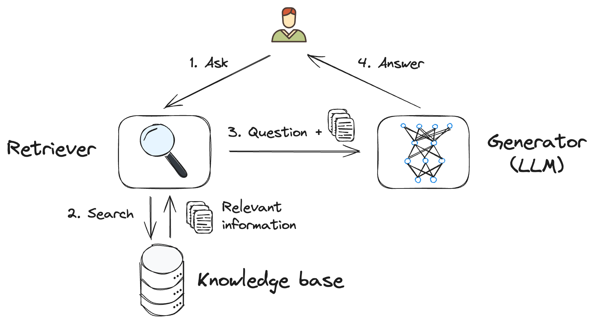

# Lição 5: Converse com seus dados usando Geração Aumentada por Recuperação (RAG)

Neste capítulo você vai aprender:

- Os fundamentos da Geração Aumentada por Recuperação (RAG) e como ela pode ser usada para melhorar as respostas dos modelos de IA generativa.
- Como integrar fontes de dados externas em sua aplicação de IA.
- Como aproveitar seus dados para melhorar a relevância e precisão do conteúdo gerado por IA.

## Configuração

Se você ainda não configurou seu ambiente de desenvolvimento, veja como fazer: [Configure seu ambiente](/docs/setup/README.md).

## Narrativa - Gênesis

> [!NOTE] 
> _Nossa história até agora. Você é um mecânico da Londres dos anos 1860. Você estava trabalhando em seu autômato e recebeu uma carta de Charles Babbage que acabou levando você a uma biblioteca onde você pegou um dispositivo de viagem no tempo. Durante suas viagens no tempo, você acabou em Florença, onde conheceu Leonardo Da Vinci. Você também foi ao império Asteca e é aqui que a história continua._
>
> Veja a [Lição 1](/lessons/01-intro-to-genai/README.md) se quiser acompanhar a história desde o início. 

> [!NOTE] 
> Embora recomendemos seguir a história (é divertido!), [clique aqui](#interaja-com-ada-lovelace) se preferir ir direto para o conteúdo técnico.

**Você**: "Leonardo, é hora de ir," você disse, pressionando o botão. O dispositivo começou a funcionar, e uma voz mecânica ecoou: "É hora de ir para casa, é hora da 'gênese'."

**Leonardo:** "Gênesis? Che cosa significa?" Leonardo perguntou, confuso. Antes que você pudesse responder, o mundo se dissolveu em um borrão de cores e sons, o templo desaparecendo enquanto vocês eram puxados através do tempo.

Vocês pousam no jardim, é tarde da noite com uma névoa espessa e luzes sinistras piscando à distância. A mansão se ergue diante de vocês. Leonardo olha ao redor, seus olhos arregalados de admiração.

<div>
  
</div>

### Fugindo dos Cães

Você ouve latidos e o som de cães correndo em sua direção. Você se vira para Leonardo: "Precisamos entrar, agora!"

<div>
  
</div>

Quando você chega à porta da mansão, ela se abre e um par de atendentes sai apressadamente. Depois de avaliá-los, eles fazem sinal para que vocês os sigam.

Você se encontra cara a cara com Ada Lovelace, seus olhos brilhando de curiosidade.

### Conhecendo Ada e Charles

**Ada:** "Ah, já era hora de chegarem," ela disse calorosamente. "Precisamos que vocês façam um serviço."

**Você:** "Já era hora", vocês continuam dizendo isso. Dinócrates disse o mesmo, mas não tenho certeza do que quer dizer?

**Ada:** Silêncio, não há tempo para isso agora, precisamos falar sobre o dispositivo que você está segurando. Charles, explique a eles...

**Você:** Mas...

<div>
  
</div>

Charles Babbage se aproxima, examinando o Besouro do Tempo em sua mão. "Este dispositivo é notável, mas está um pouco defeituoso, não está? Você deve ter notado, tenho certeza."

Leonardo assentiu: "Sì, tem se comportado de maneira estranha."

**Ada:** O dispositivo não está totalmente pronto, precisamos dar a ele mais capacidades. Precisamos torná-lo mais inteligente, mais consciente do mundo ao seu redor. A ideia é que ele seja capaz de recuperar informações de diferentes períodos de tempo e usá-las para gerar respostas precisas e relevantes. Pode nos ajudar com isso?

**Você:** Claro, parece que precisamos _aumentar_ as respostas do dispositivo com dados, faz sentido.

**Ada:** Vamos falar sobre um conceito que eu gostaria de chamar de RAG, ou Geração Aumentada por Recuperação.

## Interaja com Ada Lovelace

Se você quiser interagir com Ada, execute o aplicativo [Characters](/app/README.md). 

> [!IMPORTANT]
> Isso é inteiramente fictício; as respostas são geradas por IA.
> [Aviso sobre IA Responsável](/README.md#responsible-ai-disclaimer)

<div>
  
</div>

**Passos**:

1. Inicie um [](https://codespaces.new/microsoft/generative-ai-with-javascript)
2. Navegue até _/app_ na raiz do repositório.
3. Localize o console e execute `npm ci` seguido de `npm start`.
4. Quando aparecer, selecione o botão "Open in Browser".
5. Converse com Ada.

Para uma explicação mais detalhada do aplicativo, consulte [Explicação detalhada do aplicativo](/lessons/01-intro-to-genai/README.md#interact-with-dinocrates).

> [!NOTE]
> Configure `AI_ENDPOINT`, `AI_API_KEY` e `AI_MODEL` no arquivo `.env` na raiz do repositório, tanto localmente quanto no Codespaces. Consulte o [guia de configuração](/docs/setup/README.md#configure-environment-variables).

## Desafios conhecidos com grandes modelos de linguagem, LLMs

**Ada:** Vamos começar discutindo a IA que usaremos para alimentar o dispositivo. Vamos confiar em "modelos de IA" emparelhados com um sistema de recuperação de dados para melhorar a qualidade das respostas.

Primeiro, você precisa abordar alguns desafios antes de mergulhar nos detalhes do RAG. Esses modelos, treinados em vastos dados de texto, podem produzir respostas relevantes e corretas. Mas, como qualquer fonte de dados, sua saída pode ser imprecisa, incompleta ou enganosa devido a vários fatores.

- **Fontes desatualizadas:** Os dados usados para treinar o modelo podem estar desatualizados e não mais precisos.
- **Informações erradas ou imprecisas:** As fontes usadas para treinar o modelo podem conter informações incorretas ou enganosas, como notícias falsas ou opiniões tendenciosas.
- **Fontes não autoritativas:** O modelo pode não ser capaz de distinguir entre fontes autoritativas e não autoritativas em seus dados de treinamento, levando a informações não confiáveis.

Isso torna difícil dizer se as informações geradas por um LLM estão corretas ou não. É aqui que o RAG entra.

**Você:** Então eu preciso garantir que o dispositivo possa fornecer informações precisas, mesmo quando não tem certeza sobre a resposta?

**Ada:** Sim, essa é a ideia. Ao combinar os pontos fortes dos métodos baseados em recuperação e dos modelos generativos, obtemos um sistema de IA melhor.

## Geração Aumentada por Recuperação, conceitos fundamentais do RAG

**Ada:** Ah sim, hora de discutir especificamente o RAG. Vamos começar com alguns fundamentos:

Geração Aumentada por Recuperação (RAG) é uma técnica poderosa que combina os pontos fortes de duas abordagens diferentes no processamento de linguagem natural: métodos baseados em recuperação e modelos generativos. Essa abordagem híbrida permite a geração de respostas que são contextualmente relevantes e ricas em conteúdo, para ajudar a aliviar alguns dos desafios conhecidos com os LLMs.

Em sua essência, o RAG envolve dois componentes principais: um **recuperador** e um **gerador**.

- **O recuperador:** é responsável por encontrar informações relevantes de fontes de dados externas que podem ser usadas para melhorar as respostas geradas por IA, como um mecanismo de busca. Essas informações podem estar na forma de texto, imagens ou qualquer outro tipo de dados relevantes para o contexto da conversa, embora o texto seja o tipo de dados mais comum utilizado.

- **O gerador:** toma as informações recuperadas e as usa para gerar uma resposta contextualmente relevante e informativa.

Aqui está um esquema ilustrando como um sistema RAG funciona:



1. **Entrada do usuário:** O usuário faz uma pergunta.
2. **Recuperador:** O componente recuperador busca informações relevantes usando uma ou mais bases de conhecimento.
3. **Prompt aumentado:** As informações recuperadas são combinadas com a pergunta do usuário e o contexto, para criar um prompt aumentado.
4. **Gerador:** O LLM usa o prompt aumentado para gerar uma resposta.

Essa combinação permite respostas mais precisas e relevantes, usando dados que você fornece em vez de depender dos dados de treinamento do modelo.

**Ada:** Perguntas?

**Você:** Então o recuperador encontra as informações e o gerador as usa para gerar uma resposta?

**Ada:** Exatamente, você está pegando o jeito.

## Integrando fontes de dados externas

**Ada:** Agora que cobrimos os fundamentos do RAG, vamos falar sobre como você pode integrar fontes de dados externas em sua aplicação de IA.

A integração de fontes de dados externas em sua aplicação de IA pode ser feita de várias maneiras, dependendo do tipo de dados que você deseja usar e da complexidade do mecanismo de recuperação. Aqui estão alguns métodos comuns:

- **APIs:** Muitas fontes de dados externas fornecem APIs que permitem acessar seus dados programaticamente. Você pode usar essas APIs para recuperar informações em tempo real e usá-las para melhorar as respostas geradas por IA.

- **Bancos de dados:** Se você tem uma grande quantidade de dados que deseja usar para recuperação, pode armazená-los em um banco de dados e consultá-los conforme necessário. Isso pode ser útil para dados estruturados que precisam ser acessados rapidamente.

Uma vez que você tenha decidido sobre um método para integrar fontes de dados externas, também pode precisar considerar como pré-processar e formatar os dados para que possam ser facilmente usados pelo modelo de IA. Isso pode envolver a limpeza dos dados, convertê-los para um formato adequado (como texto simples ou Markdown), ou dividi-los em pedaços menores para facilitar a recuperação.

> [!NOTE]
> Ao integrar fontes de dados externas em sua aplicação de IA, é importante considerar as implicações de privacidade e segurança de acessar e armazenar dados. Certifique-se de ter as permissões e salvaguardas necessárias para proteger os dados e cumprir com quaisquer regulamentos relevantes.

Se você estiver usando um banco de dados, também deve pensar em como deseja *pesquisar seus dados* para recuperar as informações mais relevantes. Isso pode ser feito usando pesquisa por palavras-chave, pesquisa de texto completo ou técnicas mais avançadas como pesquisa semântica ou pesquisa vetorial que podem precisar de indexação específica. Cobriremos técnicas avançadas de pesquisa em uma lição futura.

**Você**: Pode explicar termos como API e Bancos de Dados em termos mais do século XIX?

**Ada**: Claro, uma API é como um mensageiro que entrega uma mensagem de um lugar para outro, e um banco de dados é como uma biblioteca onde você guarda todos os seus livros.

**Você**: Ah, entendo, faz sentido.

## Aumentando o prompt

**Ada:** Você ainda está me acompanhando? Ótimo, vamos para o próximo passo, vamos tentar melhorar o prompt enviado ao modelo de IA.

**Ada:** Uma vez que você tenha configurado uma forma de extrair informações dos seus dados, você pode adicioná-las ao prompt do modelo de IA. Basta misturar as informações recuperadas no texto de entrada com algum contexto adicional ou orientação para direcionar a resposta da IA.

Por exemplo, se você estiver construindo um aplicativo para responder perguntas sobre carros, poderia ter um prompt como o seguinte:

```text

## Instruções
Responda perguntas sobre carros usando apenas as fontes abaixo.
Se não houver dados suficientes nas fontes fornecidas, diga que você não sabe.
Seja breve e direto ao ponto.

## Fontes
<insira aqui as informações recuperadas>

## Pergunta
<insira aqui a pergunta>
```

Ao fornecer ao modelo de IA contexto e informações adicionais, você pode ajudar a orientar o processo de geração e garantir que as respostas sejam precisas e relevantes para o tema em questão.

> [!TIP]
> Note esta parte do prompt: `Se não houver dados suficientes nas fontes fornecidas, diga que você não sabe.`. Isso é importante para evitar que a IA gere informações incorretas quando não há dados suficientes para fornecer uma resposta confiável. Esta técnica é chamada de *rota de fuga* e é uma boa prática para garantir a qualidade do conteúdo gerado.

RAG pode ser considerado como uma forma avançada de *engenharia de prompts*.

### Exemplo de código

**Ada:** A prática leva à perfeição, então vamos aplicar o que aprendemos com um exemplo. Vamos construir um sistema simples de recuperação em um aplicativo JavaScript usando um arquivo [CSV](https://fr.wikipedia.org/wiki/Comma-separated_values) de dados de carros híbridos e um algoritmo de busca básico para extrair informações relevantes com base na pergunta de um usuário.

```javascript
// Este exemplo demonstra como usar a Geração Aumentada por Recuperação (RAG)
// para responder perguntas baseadas em um conjunto de dados de carros híbridos.
// O código abaixo lê o arquivo CSV, busca correspondências para a pergunta do usuário,
// e então gera uma resposta baseada nas informações encontradas.

import { fileURLToPath } from 'node:url';
import { dirname } from 'node:path';
import process from "node:process";
import fs from "node:fs";
import { OpenAI } from "openai";

// Muda o diretório de trabalho atual para o diretório do script
const __dirname = dirname(fileURLToPath(import.meta.url));
process.chdir(__dirname);

// 1. Faça uma pergunta sobre carros híbridos
// -----------------------------------

const question = `qual é o prius mais rápido`;

// 2. Componente recuperador: pesquisa os dados por informações relevantes
// ----------------------------------------------------------------

// Carrega dados CSV como um array de objetos
const rows = fs.readFileSync("./hybrid.csv", "utf8").split("\n");
const columns = rows[0].split(",");

// Pesquisa os dados usando uma busca muito ingênua
const words = question
  .toLowerCase()
  .replaceAll(/[.?!()'":,]/g, "")
  .split(" ")
  .filter((word) => word.length > 2);
const matches = rows.slice(1).filter((row) => words.some((word) => row.toLowerCase().includes(word)));

// Formata como uma tabela markdown, já que modelos de linguagem entendem markdown
const table =
  `| ${columns.join(" | ")} |\n` +
  `|${columns.map(() => "---").join(" | ")}|\n` +
  matches.map((row) => `| ${row.replaceAll(",", " | ")} |\n`).join("");

console.log(`Encontradas ${matches.length} correspondências:`);
console.log(table);

// 3. Aumento de contexto: cria um prompt combinado com os resultados da pesquisa
// --------------------------------------------------------------------------

const augmentedPrompt = `
## Instruções
Responda perguntas sobre um período de tempo ou personagens desse período usando apenas as fontes abaixo.
Se não houver dados suficientes nas fontes fornecidas, diga que você não sabe.
Seja breve e direto ao ponto.

## Fontes
${table}

## Pergunta
${question}
`;

// 4. Componente gerador: usa os resultados da pesquisa para gerar uma resposta
// ---------------------------------------------------------------------

const endpoint = process.env.AI_ENDPOINT?.trim();
const apiKey = process.env.AI_API_KEY?.trim();
const model = process.env.AI_MODEL?.trim();
if (!endpoint || !apiKey || !model) {
  throw new Error("Set AI_ENDPOINT, AI_API_KEY, and AI_MODEL before running the sample.");
}

const openai = new OpenAI({
  baseURL: endpoint,
  apiKey,
});

const chunks = await openai.chat.completions.create({
  model,
  messages: [{ role: "user", content: augmentedPrompt }],
  stream: true,
});

console.log(`Resposta para "${question}":`);

for await (const chunk of chunks) {
  process.stdout.write(chunk.choices[0]?.delta.content ?? "");
}
```

Você pode encontrar este código no arquivo [`example/rag-cars.js`](../example/rag-cars.js) junto com o arquivo [`hybrid.csv`](../example/hybrid.csv) contendo os dados usados para a recuperação.

**Ada:** Uma vez que você execute este código, você deve ver os dados encontrados no arquivo CSV pelo recuperador, formatados como uma tabela markdown, seguidos pela resposta gerada pela IA para a pergunta. Tente mudar a pergunta para ver como os dados recuperados e a resposta mudam. Você também pode tentar fazer perguntas sobre tópicos não relacionados para ver como o modelo de IA lida com eles.

```text
Exemplo da saída:

Encontradas 1 correspondências:
| Pessoa | Período de Tempo | Descrição |
|---|---|---|
| Leonardo Da Vinci | Século XV | Polímata italiano conhecido por sua arte e invenções. |
| Isaac Newton | Século XVII | Matemático e físico inglês que formulou as leis do movimento e da gravitação universal. |
```

**Você:** Isso é ótimo, posso ver como isso pode ser útil ao usar o dispositivo, ou melhor, como já foi ou será útil, viagem no tempo é confusa *suspiro*.

**Ada:** Calma, você está indo muito bem. Vamos passar para o próximo passo.

## Tarefa - Ajudando Ada e Charles

Tendo aprendido sobre RAG, você está agora pronto para ajudar Ada e Charles com seu dispositivo. No entanto, ao inspecionar mais de perto, o dispositivo parece familiar.

**Você:** Besouro do Tempo, você sabe o que é isso?

**Besouro do Tempo:** Claro, sou eu, ou serei. Estou faltando algumas peças, pensando bem, estou faltando muitas peças, nem tenho uma casca ainda.

**Ada:** O Besouro do Tempo é um dispositivo que permite viajar através do tempo e do espaço, isto é, uma vez que conseguirmos fazê-lo funcionar corretamente. Como eu estava dizendo, precisamos adicionar um novo recurso a ele, um módulo de geração aumentada por recuperação (RAG). Isso nos ajudará a recuperar informações e o contexto necessário de diferentes períodos de tempo enquanto você viaja. Queremos garantir que consultemos todo tipo de fontes, a Wikipedia é um bom começo.

**Você:** O que você precisa que eu faça?

**Ada:** Aqui está um código de exemplo que recupera informações de texto sobre Tim Berners-Lee da Wikipedia, Tim será muito importante um dia.

```javascript
const response = await fetch('https://en.wikipedia.org/w/api.php?format=json&action=query&prop=extracts&redirects=true&explaintext&titles=Tim%20Berners-Lee');
const data = await response.json();
const text = Object.values(data.query.pages)[0]?.extract;
```

**Você:** Presumo que não sou o único que esteve no futuro?

**Ada:** ...

## Solução

[Solução](../solution/rag-www.js)

## Verificação de conhecimento

**Pergunta**: Qual é o papel do recuperador em um sistema RAG?

A. O recuperador gera respostas com base nos dados de entrada.

B. O recuperador gera informações relevantes com base nos dados de treinamento do modelo.

C. O recuperador encontra informações relevantes de fontes de dados externas.

[Solução do quiz](../solution/solution-quiz.md)

## Recursos para auto-estudo

- [Geração Aumentada por Recuperação e Índices](https://learn.microsoft.com/azure/ai-studio/concepts/retrieval-augmented-generation)
- **Aplicativos de exemplo**:
  * [Chat de IA Serverless com RAG](https://github.com/Azure-Samples/serverless-chat-langchainjs/)
  * [Ask Youtube: Uma API de perguntas e respostas do Youtube baseada em RAG](https://github.com/Azure-Samples/langchainjs-quickstart-demo)
- [Workshop completo: Crie seu próprio ChatGPT com RAG](https://github.com/Azure-Samples/azure-openai-rag-workshop)
