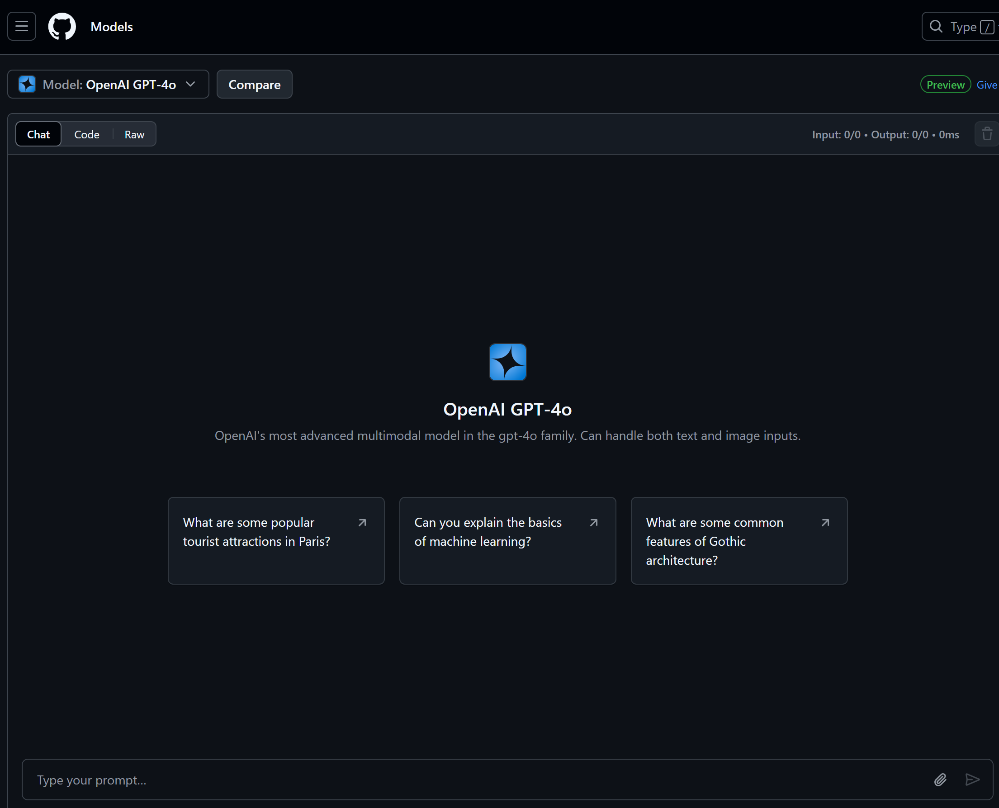
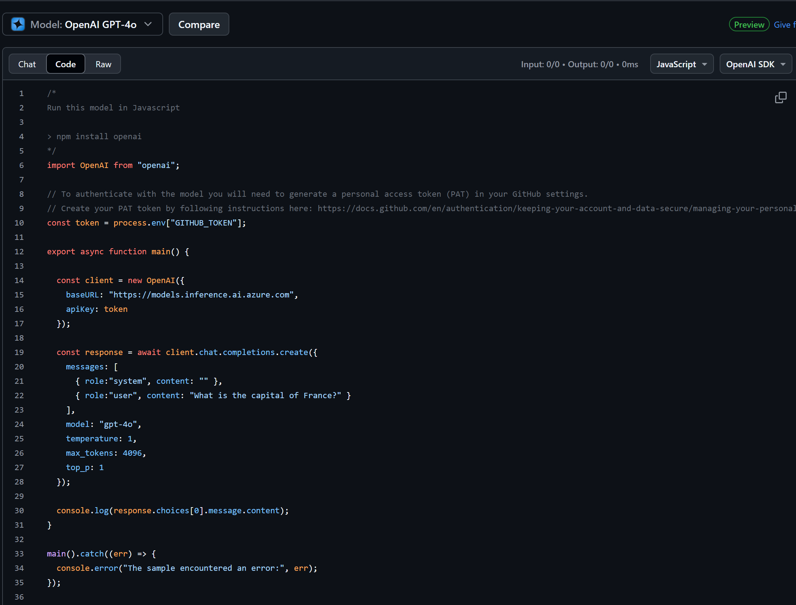

# Setting Up the Development Environment for This Course

This lesson will guide you through setting up your development environment for this course. 

There are many ways to set up your development environment, but we wanted to recommend a few options that will provide you with the best experience.

- **Your chosen environment**. There's essentially two ways to set up your development environment for this course:
  - **Option 1: GitHub Codespaces**: You can either use GitHub Codespaces. You can configure your GitHub Codespace by creating what's called a `.devcontainer` directory in the root of your repository. This will allow your GitHub Codespace environment to be pre-configured with all the tools and libraries you need so you can get started right away. See the file `.devcontainer/devcontainer.json` for installed Visual Studio Code extensions and other settings.
  - **Option 2: Run locally**: set up your local machine. This will require you to install the necessary tools and libraries on your machine. A way to make this easier is to use a local devcontainer. This is a Docker container that has all the tools and libraries you need to run the app. You can find the `devcontainer.json` file in the `.devcontainer` directory.
- **Access to AI models**. You can use GitHub Models or Azure OpenAI to interact with large language models. GitHub Models is free and easy to set up, while Azure OpenAI is a paid service that provides access to a wide range of AI models. How to set the latter up is covered [here](./getting-started-azure-openai.md).

## Which AI service should I use for this course?

We provide instructions for setting up your development environment with GitHub Models and Azure OpenAI. You can choose the one that best fits your needs. We recommend using GitHub Models for this course, but you can use any of these services.

## Choose your setup 

> If **GitHub Models** is your choice, follow the rest of this document to set up your development environment with GitHub Models.
> - **Azure OpenAI** have your eye? [This is the document for you](getting-started-azure-openai.md).

## Quick Start

The fastest way to get started is to use GitHub Codespaces as this will provide you with a pre-configured environment that has access to GitHub Models without any additional setup.

However, if you prefer to work on your local machine, there's a section below that will guide you through setting up your [local environment](#option-2--running-the-app-locally).

## GitHub Models explained

GitHub Models offers the following features:

- **Free access to AI models**: Experiment with various AI models for free.
- **Interactive playground**: Test and interact with different models directly within your development environment.
- **Reliable access**: Hosted within GitHub's infrastructure, these models offer reliable access and consistent performance.

### Free access to AI models

GitHub Models provides an intuitive way to experiment with various AI models directly within your development environment. This feature allows developers to test and interact with different models, understanding their capabilities and limitations before implementation.

### Interactive playground

To test out various AI models, GitHub Models offers an interactive playground. This feature allows developers to select from different models, input prompts, and evaluate model responses.

> Here's a [playground](https://github.com/marketplace/models) for you to test and explore different AI models. 



Additionally, developers can grab code snippets to integrate these models into their applications.



Through a simple interface, you can explore model responses, evaluate performance, and determine the best fit for your application requirements. Hosted within GitHub's infrastructure, these models offer reliable access and consistent performance, making them ideal for development and testing phases. Best of all, there is a free tier to start your exploration without any cost.

**Getting started**

To get started with GitHub Models, you need the following:

- **A GitHub account**, you can sign up for free at GitHub.com.
- **Optional: A personal access token**, this is something you will create in the next section. A token will uniquely identify you when you interact with GitHub Models. This step is optional if you're using GitHub Codespaces (as you can rely on the built-in token `GITHUB_TOKEN`) but mandatory if you're running the app locally.

## Optional: Setting up GitHub Access Tokens

> [!NOTE] 
> You only need to do this step if you plan to use GitHub Models from your local machine. If you're using GitHub Codespaces, you can skip this step as there's a built-in variable called `GITHUB_TOKEN` that can access GitHub Models from within your GitHub Codespaces instance.

> [!TIP]
> From a security standpoint, it's always a good idea to create a personal access token (PAT) with a limited scope and short expiration time.

### Creating a Personal Access Token, PAT for GitHub Model access

1. Navigate to [GitHub Settings](https://github.com/settings/profile):

    - Click your profile picture in the top-right corner
    - Select **Settings** from the dropdown menu

    

1. Access [Developer Settings](https://github.com/settings/apps):

    - Scroll down the left sidebar
    - Click on **Developer settings** (usually at the bottom)

    

1. Generate a New Token:

    - Select **Personal access tokens** → **Tokens (classic)**

        

    - In the dropdown in the middle of the page, click **Generate new token (classic)**

        

    - Under "Note", provide a descriptive name (e.g., `GenAI-JavaScript-Course-Token`)
    - Set an expiration date (recommended: 7 days for security best practices)
    - There is no need adding any permissions to this token.

> 💡 **Security Tip**: Always use the minimum required scope and shortest practical expiration time for your access tokens. This follows the principle of least privilege and helps maintain your account's tokens safe.

## Option 1 : Creating a GitHub Codespace

> [!NOTE]
> You don't strictly need to create a GitHub Codespace instance to test out GitHub Models, but it's a nice way to get an environment where extensions and tools are pre-installed and ready to go. Let's cover first how to create a GitHub Codespace and in the next section, it will be explained how to run locally. 

Let's create a GitHub Codespace to use for the rest of this course.

1. Open this repository's main page in a new window by [right-clicking here](https://github.com/microsoft/generative-ai-with-javascript) and selecting **Open in new window** from the context menu
1. Fork this repo into your GitHub account by clicking the **Fork** button in the top right corner of the page
1. Click the **Code** dropdown button and then select the **Codespaces** tab
1. Select the **+** option.

    

### Verifying your Codespace is running correctly with GitHub Models

Once your Codespace is fully loaded and configured, let's run a sample app to verify everything is working correctly.

> [!NOTE]
> If you are using a personal access token, you need to update the code in `app.js` in the `/app` directory to use your token. You can access your token using `process.env.<name of access token>`. If not, you can skip this instruction in this note.

Follow these steps to run the sample app:

1. Open the terminal. Open a terminal window (if it's not open already).

1. Switch to the proper directory by running the following command (providing you're in the repo root):

    ```bash
    cd app
    ```

1. Install all the dependencies by running the following command:

    ```bash
    npm install
    ```

1. Run the application by running the following command:

    ```bash
    npm start
    ```

1. It may take a couple of seconds, but eventually the application should start. You should see a message link to open a browser to `http://localhost:3000` displayed in the terminal.

> 🙋 **Need help?**: Something not working? [Open an issue](https://github.com/microsoft/generative-ai-with-javascript/issues/new?template=Blank+issue) and we'll help you out.


## Option 2 : Running the app locally

Even if GitHub Codespaces is a great way to get started, you can also run the app locally on your machine. To do so, you need to do the following. Start this step by copying the value for your token you created earlier in GitHub.

- **Create and set an environment variable**: You need to set an environment variable with the token you created earlier. Create the variable and assign it the value of the token.

    on macOS or Linux, you can set an environment variable using the following command:

    ```sh
    export GITHUB_TOKEN=<your-token value>
    ```

    on Windows, you can set an environment variable using the following command:

    ```sh
    set GITHUB_TOKEN=<your-token value>
    ```

    > [!TIP]
    > You're recommended to create an `.env` file in the root and add [dotenv](https://www.npmjs.com/package/dotenv) to your project to manage your environment variables. Then you can access your token using `process.env.GITHUB_TOKEN`.

    ```javascript
    // add to top of app.js file in /app directory
 
    require('dotenv').config();
    const token = process.env.TOKEN; // your token value

    ```

- **Run the app**: You can run the app by following the same steps as above, but instead of running `npm start` in the Codespace terminal, you can run it in your local terminal.

## Summary

In this lesson, you learned how to set up your development environment for the rest of the course. You created a GitHub Codespace or did a local setup and configured it to use GitHub Models. You also learned how to create a personal access token for GitHub Models and how to run a sample application to verify everything is working correctly.

### Additional Resources

You're encouraged to explore the following resources to deepen your understanding:

- [Azure OpenAI](getting-started-azure-openai.md) to learn how to use Azure OpenAI in your development environment.
- [GitHub Codespaces Documentation](https://docs.github.com/en/codespaces)
- [GitHub Models Documentation](https://docs.github.com/en/github-models/prototyping-with-ai-models)

